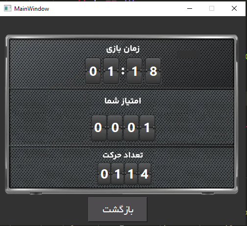

# Assignment-19
---
## Puzzle 15
### Puzzle 15 is a classic sliding puzzle game where the player must rearrange the tiles in numerical order by sliding them into the empty space. The game consists of a 4x4 grid with numbered tiles, and the objective is to arrange the tiles in ascending order from 1 to 15, with the empty space in the bottom right corner.

## Password Generator

## Guess Number
